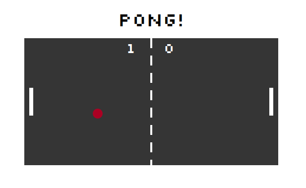
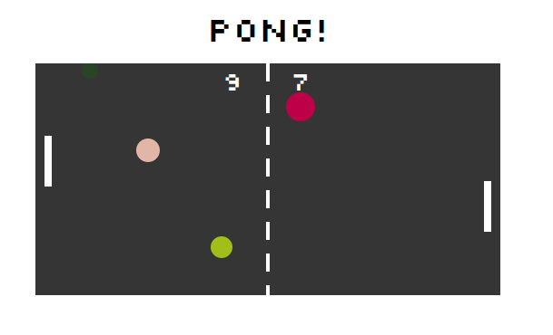
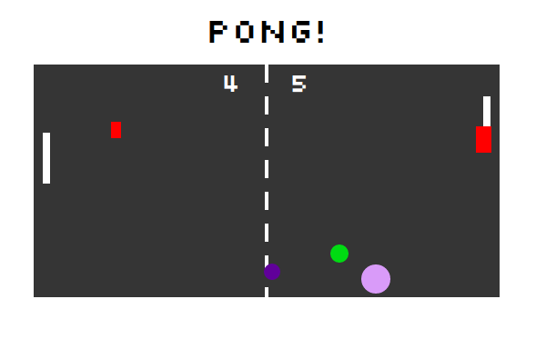
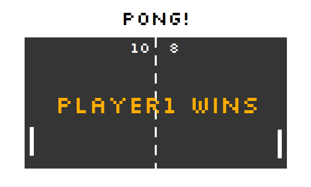

# Pong Game Starter

A starter project for a basic pong game using SVGs.

## Setup

Ensure you have [Node.js](https://nodejs.org/en/) installed first.

**Install dependencies:**

`$ npm install`

**Run locally with the Parcel dev server:**

`$ npm start`

Once you run the start command you can access your project at http://localhost:3000.

Read more about the [Parcel web application bundler here](https://parceljs.org/).

## Technologies used

* Javascript

* HTML

* CSS

* NodeJS

* SVG

## Personal learnings

- create a project with object-oriented javascript
- develop an animation with iteration of two users
- apply mathematical concepts with javascript
- understand how npm projects work

## Stretching goals accomplished

-   Trigger multiple balls 
    
- Create balls with special effects (different speeds, sizes, effects, etc.)
-   Trigger speed changes
-   Fire a shot with sounds from a paddle on key press ('d' and 'ArrowLeft') 
    
-   Declare a winner at a final score 
    
